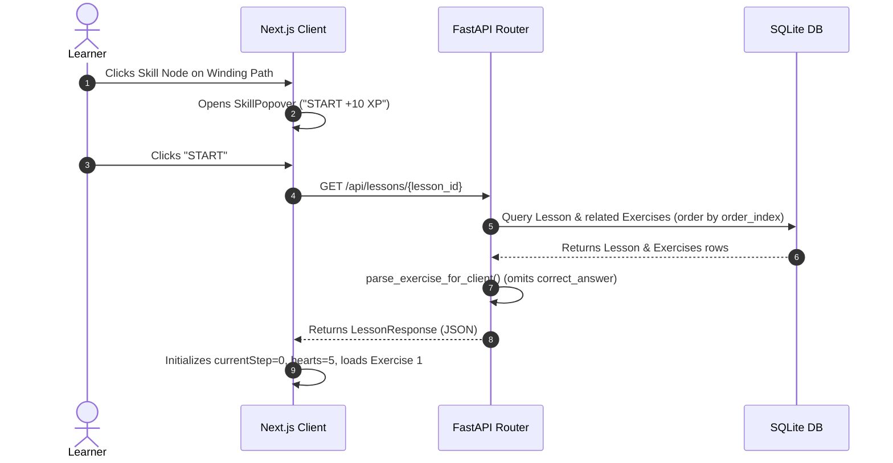
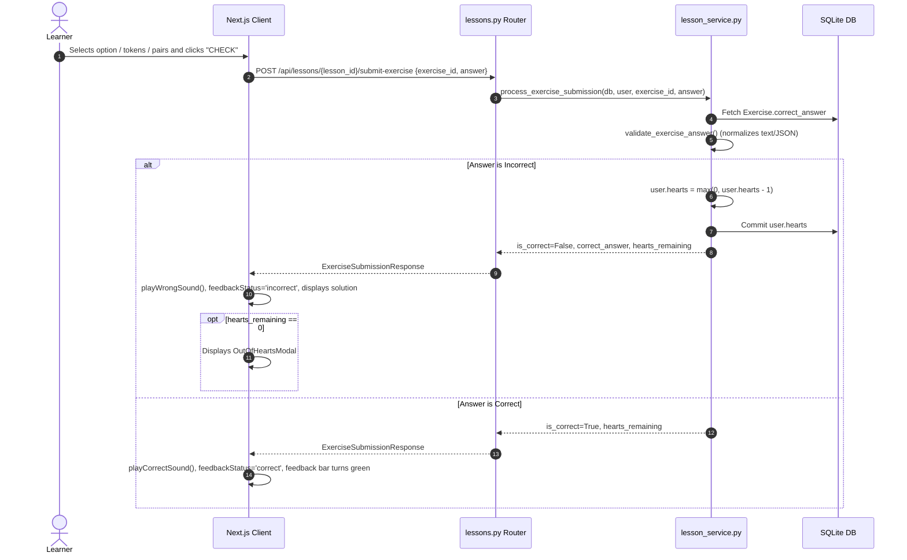
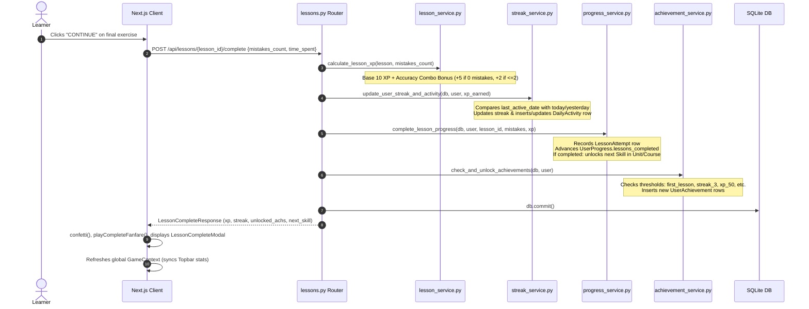

# End-to-End Data Flow Documentation: Duolingo Clone

## 1. Flow: Start Lesson

```mermaid
sequenceDiagram
    autonumber
    actor User as Learner
    participant UI as Next.js Client
    participant API as FastAPI Router
    participant DB as SQLite DB

    User->>UI: Clicks Skill Node on Winding Path
    UI->>UI: Opens SkillPopover ("START +10 XP")
    User->>UI: Clicks "START"
    UI->>API: GET /api/lessons/{lesson_id}
    API->>DB: Query Lesson & related Exercises (order by order_index)
    DB-->>API: Returns Lesson & Exercises rows
    API->>API: parse_exercise_for_client() (omits correct_answer)
    API-->>UI: Returns LessonResponse (JSON)
    UI->>UI: Initializes currentStep=0, hearts=5, loads Exercise 1
```

---

## 2. Flow: Submit Exercise & Heart Deduction

```mermaid
sequenceDiagram
    autonumber
    actor User as Learner
    participant UI as Next.js Client
    participant Router as lessons.py Router
    participant Service as lesson_service.py
    participant DB as SQLite DB

    User->>UI: Selects option / tokens / pairs and clicks "CHECK"
    UI->>Router: POST /api/lessons/{lesson_id}/submit-exercise {exercise_id, answer}
    Router->>Service: process_exercise_submission(db, user, exercise_id, answer)
    Service->>DB: Fetch Exercise.correct_answer
    Service->>Service: validate_exercise_answer() (normalizes text/JSON)
    
    alt Answer is Incorrect
        Service->>Service: user.hearts = max(0, user.hearts - 1)
        Service->>DB: Commit user.hearts
        Service-->>Router: is_correct=False, correct_answer, hearts_remaining
        Router-->>UI: ExerciseSubmissionResponse
        UI->>UI: playWrongSound(), feedbackStatus='incorrect', displays solution
        opt hearts_remaining == 0
            UI->>UI: Displays OutOfHeartsModal
        end
    else Answer is Correct
        Service-->>Router: is_correct=True, hearts_remaining
        Router-->>UI: ExerciseSubmissionResponse
        UI->>UI: playCorrectSound(), feedbackStatus='correct', feedback bar turns green
    end
```

---

## 3. Flow: Lesson Completion & Gamification Updates

```mermaid
sequenceDiagram
    autonumber
    actor User as Learner
    participant UI as Next.js Client
    participant Router as lessons.py Router
    participant LService as lesson_service.py
    participant SService as streak_service.py
    participant PService as progress_service.py
    participant AService as achievement_service.py
    participant DB as SQLite DB

    User->>UI: Clicks "CONTINUE" on final exercise
    UI->>Router: POST /api/lessons/{lesson_id}/complete {mistakes_count, time_spent}
    
    Router->>LService: calculate_lesson_xp(lesson, mistakes_count)
    Note over LService: Base 10 XP + Accuracy Combo Bonus (+5 if 0 mistakes, +2 if <=2)
    
    Router->>SService: update_user_streak_and_activity(db, user, xp_earned)
    Note over SService: Compares last_active_date with today/yesterday<br/>Updates streak & inserts/updates DailyActivity row
    
    Router->>PService: complete_lesson_progress(db, user, lesson_id, mistakes, xp)
    Note over PService: Records LessonAttempt row<br/>Advances UserProgress.lessons_completed<br/>If completed: unlocks next Skill in Unit/Course
    
    Router->>AService: check_and_unlock_achievements(db, user)
    Note over AService: Checks thresholds: first_lesson, streak_3, xp_50, etc.<br/>Inserts new UserAchievement rows
    
    Router->>DB: db.commit()
    Router-->>UI: LessonCompleteResponse (xp, streak, unlocked_achs, next_skill)
    UI->>UI: confetti(), playCompleteFanfare(), displays LessonCompleteModal
    UI->>UI: Refreshes global GameContext (syncs Topbar stats)
```
